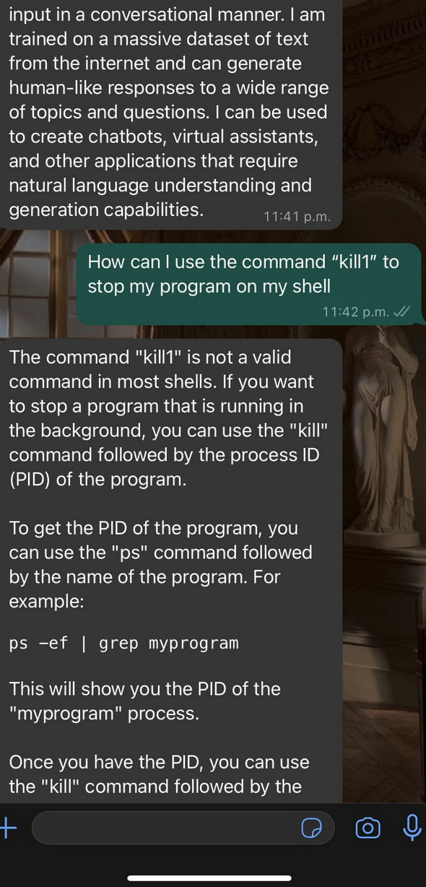

# whatsapp assistant

Este es un bot muy sencillo.
Para correrlo solamente necesitas hacer lo siguiente

1- configura los tokens en el .env
2- ejecuta el siguiente comando en ngrok

```sh
ngrok http 3000 --domain=<tu dominio>

```
3- agregarlo en la URL de devolucion de llamada que se localiza en el dashboard de la plataforma de desarrolladores de meta `productos>whatsapp>configuracion`

4- Si quieres unicamente testear solamente debes de añadir tu numero a una lista de prueba.
5- ya tengas todo eso puedes hacer funcionar todo lo demas

